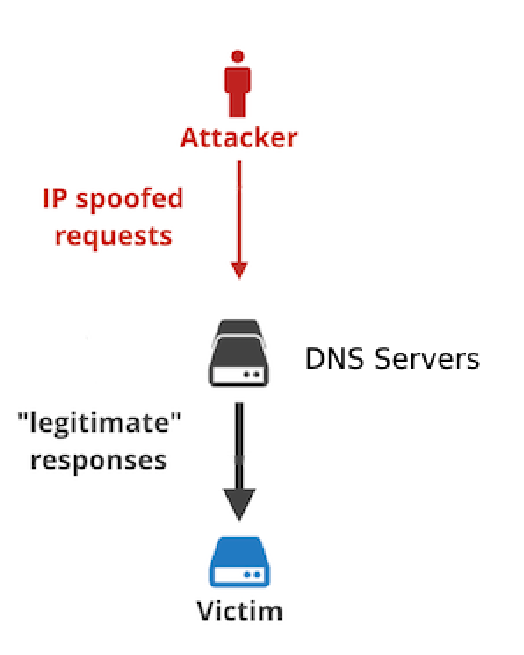

# LINFO237 Project 2

## Network attacks and protection

## Authors

- **Da Silva Mathos, Pedro** - *02092000*
- **Jeanmenne, Nicolas** - *48741900*

---
# Introduction

- Topology : reused from the homework with our modifications
- Attacks : scripts we made in Go (*v1.24.2*)
- Protection : nftables firewall

---
# Reflected DoS

## Attack

- run our script on a server which responds to the target
  

## Protection

- Rate limit number of packets
- Blacklist IPs
- Drop packets of IPs in blacklist

---
# SSH Brute Force

## Attack

- Take a password list
- Launch the script which try every password (and none) to the target user
- Threaded option to speed up the attack

## Protection

- Limit rate of new ssh connections (3/min)
- Optional : change the default ssh port in `/etc/ssh/sshd_config`
- Optional : allow only public key authentication (limit attack surface)
  
---
# SYN scan

## Attack

## Protection

- Rate limit number of packets
- Blacklist IPs
- Drop packets of IPs in blacklist

---
# SYN flood

## Attack

- Build our own SYN packets with selected IPs and ports
- Flood the target with SYN packet and starve TCP connections
- Threaded option to accelerate starvation

## Protection

- Rate limit number of new connections / SYN packets per second
- Blacklist IPs who exceed the limit
- Ensure SYN cookies are enabled

---
# Improvements

Here are some ideas which could be implemented to improve the project

- Honeypot
  - SSH : create many fake users / root accounts, fake server

- Fail2ban : easier configuration

---
# Conclusion

- Attacks are easy to implement, tools for real attacks even more effective
- Protection is crucial for services exposed and users safety

---
# References

- <https://media.geeksforgeeks.org/wp-content/uploads/20220906112959/white.jpg>
- <https://cf-assets.www.cloudflare.com/zkvhlag99gkb/37shntzMKVznz96CFNVl4n/c7d72b8761f9c5c89ef10a41cd3b398b/Untitled-2.001saaa.png> (reworked)
